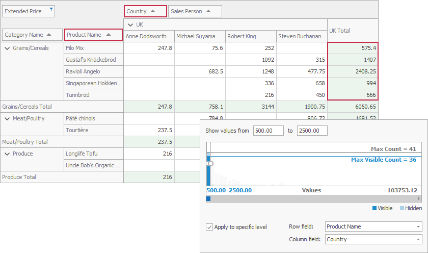

<!-- default badges list -->

<!-- default badges end -->
<!-- default file list -->
*Files to look at*:

* [Form1.cs](./CS/XtraPivotGrid_ApplySummaryFilter/Form1.cs) (VB: [Form1.vb](./VB/XtraPivotGrid_ApplySummaryFilter/Form1.vb))
<!-- default file list end -->

# How to Apply Summary Filter

This example demonstrates how to apply a summary filter to a particular aggregation level.

The PivotGridControl displays product sales by country. The summary filter is applied to country totals calculated for individual products to display values in the range from 500 to 2500. The filter applies to an aggregation level identified by the fieldProductName and fieldCountry fields.

API in this example:

* [PivotSummaryFilter.StartValue](https://docs.devexpress.com/CoreLibraries/DevExpress.XtraPivotGrid.PivotSummaryFilter.StartValue)
* [PivotSummaryFilter.EndValue](https://docs.devexpress.com/CoreLibraries/DevExpress.XtraPivotGrid.PivotSummaryFilter.EndValue)
* [PivotSummaryFilter.Mode](https://docs.devexpress.com/CoreLibraries/DevExpress.XtraPivotGrid.PivotSummaryFilter.Mode)
* [PivotSummaryFilter.RowField](https://docs.devexpress.com/CoreLibraries/DevExpress.XtraPivotGrid.PivotSummaryFilter.RowField)
* [PivotSummaryFilter.ColumnField](https://docs.devexpress.com/CoreLibraries/DevExpress.XtraPivotGrid.PivotSummaryFilter.ColumnField)

See also:

* [Summaries](https://docs.devexpress.com/WindowsForms/9384)
* [Aggregation Levels](https://docs.devexpress.com/WindowsForms/11729)
<!-- feedback -->
## Does this example address your development requirements/objectives?

 

(you will be redirected to DevExpress.com to submit your response)
<!-- feedback end -->
